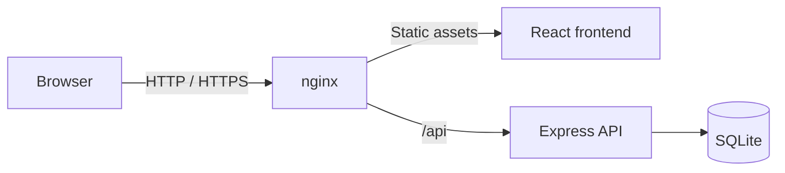

<div align="center">

# Trading Journal

**A focused, self-hosted trading journal for recording decisions, reviewing execution and learning from completed trades.**

[](https://github.com/nmc03/trading-journal/actions/workflows/ci.yml)
[](LICENSE)
[](https://nodejs.org/)
[](https://docs.docker.com/compose/)

No cloud account. No subscription. Your journal stays in your own SQLite database.

</div>

---

<p align="center">
  
</p>

<p align="center"><sub>Screenshot uses synthetic demo trades — no real trading data is shown.</sub></p>

## Why this project exists

Most trading journals become either spreadsheets that are hard to review or platforms that require yet another account and subscription.

Trading Journal is deliberately smaller. It gives one person a clean place to record a trade, capture the reasoning behind it and review what is actually working — while keeping the data on infrastructure they control.

It was originally built for personal use and is now published as open source.

## What you get

| Area | Included |
| --- | --- |
| Trade journal | Long/short trades, entry, exit, stop, target and position size |
| Process review | Setup, entry rationale, notes and whether the trading plan was followed |
| Costs | Entry/exit commissions |
| Multi-currency | EUR and USD with a configurable EUR/USD conversion rate |
| Review metrics | P&L, win rate, expectancy and realised R/R |
| Setup analysis | Performance grouped by setup type |
| Open positions | Open trades remain visible separately from completed trades |
| Persistence | Local SQLite database |
| Access | Single-user authentication with expiring JWTs |
| Deployment | Docker Compose with nginx in front of the API |

The interface is responsive and intended to remain usable on desktop and mobile.

## Quick start

You only need Docker and Docker Compose.

```bash
git clone https://github.com/nmc03/trading-journal.git
cd trading-journal

cp backend/.env.example backend/.env
```

Edit `backend/.env` and replace all example values. Generate a strong JWT secret with:

```bash
openssl rand -base64 48
```

Start the application:

```bash
docker compose up -d --build
```

Then open:

```text
http://localhost:8080
```

To use another host port:

```bash
HTTP_PORT=8088 docker compose up -d
```

> [!IMPORTANT]
> The example credentials in `backend/.env.example` are intentionally rejected by the application. Replace them before starting the service.

## How it is structured



The backend is not exposed directly by the included Compose file. nginx serves the frontend and proxies `/api` to the API over the private Docker network.

### Stack

- React 19 + Vite
- Express 5
- SQLite via `better-sqlite3`
- nginx
- Docker Compose
- Node.js 24

## Configuration

`backend/.env` supports:

| Variable | Required | Purpose |
| --- | --- | --- |
| `TJ_USER` | Yes | Login username |
| `TJ_PASSWORD` | Yes | Login password |
| `JWT_SECRET` | Yes | Random secret, minimum 32 characters |
| `PORT` | No | API port; defaults to `3001` |
| `TRUST_PROXY_HOPS` | No | Trusted proxy hops; defaults to `1` for the bundled nginx setup |
| `CORS_ORIGIN` | No | Comma-separated allowed origins when using a separate frontend |

The application refuses to start with the password or JWT secret shipped in `.env.example`.

## Data ownership and backups

All journal data is stored under:

```text
./data/
```

That directory, real `.env` files and SQLite databases are excluded from Git.

For a simple consistent backup:

```bash
docker compose down
tar -czf trading-journal-data.tar.gz data/
docker compose up -d
```

For an active long-running deployment, use your normal host-level or filesystem backup strategy instead of relying only on manual archives.

## Security model

This is a small single-user application, not a multi-tenant trading platform.

The included deployment provides:

- bcrypt password hashing
- JWT authentication with 8-hour expiry
- rate limiting on login attempts
- validated API input
- parameterised SQLite queries
- nginx security headers and Content Security Policy
- an internal-only backend service
- secret and database exclusions in `.gitignore`

If the application is reachable from the Internet, terminate HTTPS in a reverse proxy in front of it.

See [SECURITY.md](SECURITY.md) for vulnerability reporting.

## Metrics: what they mean

The journal calculates useful review statistics from closed trades, including win rate, realised R/R, expectancy, P&L and results by setup.

The displayed **compounded return** is intentionally labelled as a theoretical composition of each closed trade's percentage result.

It is **not**:

- Time-Weighted Return (TWR)
- Money-Weighted Return (MWR)
- account-level portfolio performance

This distinction matters if you compare the journal with broker or portfolio-reporting figures.

## Development

Backend:

```bash
cd backend
cp .env.example .env
npm ci
node --env-file=.env server.js
```

Frontend, in another shell:

```bash
cd frontend
npm ci
npm run dev
```

Vite proxies `/api` to `http://localhost:3001` during development.

### Checks

Backend:

```bash
cd backend
npm test
npm run check
npm audit --omit=dev --audit-level=high
```

Frontend:

```bash
cd frontend
npm run build
npm audit --audit-level=high
```

The GitHub Actions workflow runs these checks and also validates the Compose configuration and builds both Docker images.

## Project scope

Trading Journal is intentionally opinionated:

- one user
- one local journal
- no broker integration
- no market-data feed
- no automated trading
- no cloud dependency
- no registration or role system

That small scope keeps the project understandable and easy to self-host.

## Contributing

Focused fixes and improvements are welcome. Read [CONTRIBUTING.md](CONTRIBUTING.md) before opening a pull request.

The project is published as-is and is not currently maintained as a commercial product.

## Financial disclaimer

Trading Journal is a record-keeping and analysis tool. It does not provide investment advice, brokerage services or guarantees about trading performance.

## License

Released under the [MIT License](LICENSE).
